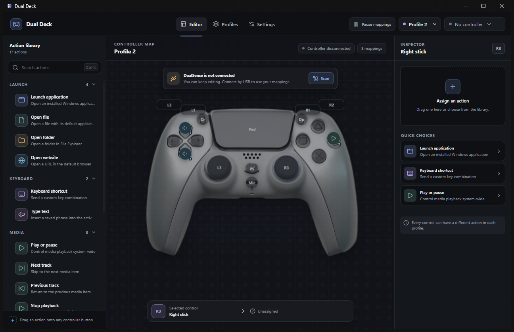

# Dual Deck

<p align="center">
  
</p>

<p align="center">
  Turn a DualSense controller into a customizable desktop action deck for Windows.
</p>

<p align="center">
  <a href="https://github.com/sushi-dev55/Dual-Deck/actions/workflows/ci.yml"></a>
  <a href="LICENSE"></a>
  
  
</p>

Dual Deck maps the controls on one first-party PlayStation 5 DualSense controller to desktop
actions. Launch an application, open a file, send a keyboard shortcut, control media, call a
webhook, or switch profiles without leaving the application you are using. The native runtime
continues working from the Windows notification area when the editor is hidden.

> [!IMPORTANT]
> Dual Deck is currently at version `0.1.0` and is not a stable release. USB controller discovery
> has been verified on one Windows 11 system, but the complete end-to-end hardware matrix is still
> in progress. There is no official signed installer yet.

## What works today

- One first-party DualSense controller at a time
- Front-facing controller editor with 19 independently mappable controls
- Drag-and-drop action assignment with automatic saving
- Press, release, long-press, double-press, and hold-repeat triggers
- Manual profile creation, duplication, activation, renaming, deletion, and mapped profile
  switching
- Notification-area controls for opening Dual Deck, switching profiles, pausing mappings, and
  quitting
- Optional Windows startup, start-minimized, minimize-to-tray, and close-to-tray behavior
- Local SQLite persistence for profiles, mappings, and preferences
- Reduced-motion support and keyboard-visible focus states
- No account, analytics, telemetry, or cloud service

### Available actions

| Category | Actions                                                                   |
| -------- | ------------------------------------------------------------------------- |
| Launch   | Open an application, file, folder, or HTTP/HTTPS website                  |
| Keyboard | Send a key combination or type saved text into the active window          |
| Media    | Play/pause, next, previous, stop, volume up/down/mute, or play a WAV file |
| Workflow | Send an HTTP/HTTPS webhook, close an application, or switch profile       |

Actions can also be run from the inspector while a mapping is selected. Application paths, typed
text, shortcuts, endpoints, and other mapping configuration are stored locally.

## Current boundaries

Dual Deck uses pass-through input. A mapped controller button still reaches the foreground game or
application. Dual Deck does not install an input-hiding driver, suppress controller input, or
create a virtual controller. Pause mappings from the notification-area menu before playing a game
when mapped actions should not run.

The following are not shipped user-facing capabilities:

- Automatic foreground-application profile switching
- Multi-action editing
- Profile import, export, or backup
- Native OBS actions
- Automatic updates
- Multiple active controllers
- Other controller families
- Linux or macOS builds

Bluetooth is implemented through the SDL controller layer, but it has not passed a physical
hardware test and is not part of the current support claim. See the
[hardware test matrix](docs/hardware-test-matrix.md) for verified evidence and outstanding work.

## Install and run

### Official releases

An official signed installer has not been published. When releases begin, supported installers
and checksums will be published only on the
[Dual Deck Releases page](https://github.com/sushi-dev55/Dual-Deck/releases). Do not treat
executables from another location as official Dual Deck builds.

### Build from source

The current development environment targets 64-bit Windows and requires:

- Windows 10 64-bit or Windows 11
- A first-party DualSense controller connected by USB
- [Node.js](https://nodejs.org/) 24
- [pnpm](https://pnpm.io/) 10
- [Rust](https://rustup.rs/) 1.85 or newer
- The `stable-x86_64-pc-windows-gnu` Rust toolchain
- [MSYS2](https://www.msys2.org/) with the MinGW-w64 64-bit GCC toolchain
- Microsoft Edge WebView2 Runtime

Install and select the Rust toolchain:

```powershell
rustup toolchain install stable-x86_64-pc-windows-gnu --profile minimal --component rustfmt,clippy
rustup override set stable-x86_64-pc-windows-gnu
```

Install dependencies and start the desktop application:

```powershell
pnpm install --frozen-lockfile
pnpm tauri dev
```

`pnpm dev` starts only a browser interface preview. Controller input, tray behavior, native
actions, startup settings, and SQLite persistence require `pnpm tauri dev`.

### Build a local installer

```powershell
pnpm tauri build --target x86_64-pc-windows-gnu
```

The executable and NSIS installer are written under:

```text
%LOCALAPPDATA%\DualDeck\cargo-target\x86_64-pc-windows-gnu\release
```

The NSIS package installs for the current Windows user and downloads WebView2 when it is missing.
Local packages are unsigned development builds. Windows code signing and release verification are
required before an installer can be published as official.

## First use

1. Connect one first-party DualSense controller over USB.
2. Start Dual Deck and open the **Deck** view.
3. Drag an action from the library onto a controller control.
4. Select the control and finish its configuration in the inspector.
5. Choose the trigger behavior and press **Run action** to check the mapping.
6. Create additional profiles from **Profiles** and map a controller button to profile switching
   when useful.

Release builds start with Windows, launch minimized, and use the notification area by default. If
the editor is not visible, open the hidden-icons arrow in the Windows taskbar and choose **Open
Dual Deck** from the Dual Deck icon. These behaviors can be changed under **Settings > General**.

## Development checks

Run the complete local verification suite before opening a pull request:

```powershell
pnpm format:check
pnpm check
pnpm test
pnpm build
pnpm cargo fmt --manifest-path src-tauri/Cargo.toml --all -- --check
pnpm cargo check --manifest-path src-tauri/Cargo.toml --locked --all-targets --target x86_64-pc-windows-gnu
$env:RUSTFLAGS = "-Dwarnings"
pnpm cargo clippy --manifest-path src-tauri/Cargo.toml --locked --all-targets --target x86_64-pc-windows-gnu
Remove-Item Env:RUSTFLAGS
pnpm cargo test --manifest-path src-tauri/Cargo.toml --locked --all-targets --target x86_64-pc-windows-gnu
```

The `pnpm cargo` and `pnpm tauri` wrappers keep Rust build artifacts in
`%LOCALAPPDATA%\DualDeck\cargo-target`. This avoids a Windows GNU linker limitation when the
repository path contains spaces. To override it, set `DUALDECK_CARGO_TARGET_DIR` to an absolute,
whitespace-free directory. If MSYS2 is not installed at `C:\msys64\mingw64`, set
`DUALDECK_MINGW_BIN` to its absolute, whitespace-free `bin` directory.

For a longer manual controller event session:

```powershell
$env:PATH = "$(Resolve-Path src-tauri\vendor\sdl3\bin);$env:PATH"
$env:DUALDECK_PROBE_DURATION_MS = "30000"
pnpm cargo run --manifest-path src-tauri/Cargo.toml --locked --target x86_64-pc-windows-gnu --example controller_probe
Remove-Item Env:DUALDECK_PROBE_DURATION_MS
```

## Project structure

```text
src                         Svelte interface
src/lib/services            Typed desktop API boundary and browser preview adapter
src-tauri/src               Rust application core
src-tauri/src/controller    SDL-backed controller runtime
src-tauri/src/platform      Native operating-system actions
src-tauri/vendor/sdl3       Audited SDL runtime and import libraries
scripts                     Windows development command wrapper
assets                      Project artwork
src/assets                  Licensed interface media
docs                        Architecture, hardware, and release documentation
```

The Rust process owns controller monitoring, persistent state, action execution, tray behavior,
and native Windows integrations. The Svelte interface renders application state and sends typed
commands through Tauri. See [Architecture](docs/architecture.md) for the runtime boundaries and
data flow.

## Privacy and security

Dual Deck stores profiles and preferences on the local computer. It makes an outbound request only
when a user runs a configured webhook. Opening a website delegates the URL to the default browser.
The current application has no updater endpoint or update request.

Native actions use typed data validated by the Rust backend. Profile text is not passed to a
command shell. Profiles can still contain sensitive paths, typed text, webhook URLs, and webhook
headers, so local database copies should be handled as private data.

Report security issues privately using [the security policy](SECURITY.md). Use the
[issue tracker](https://github.com/sushi-dev55/Dual-Deck/issues) for non-sensitive bugs and focused
feature requests.

## Roadmap

Roadmap items describe direction, not a delivery promise:

1. Complete the Windows 10 and Windows 11 USB hardware matrix.
2. Verify Bluetooth behavior on physical hardware.
3. Publish a reviewed, code-signed Windows installer.
4. Add signed automatic updates through GitHub Releases.
5. Expose multi-actions, automatic profiles, and safe profile backup/import/export.
6. Add native streaming integrations, more controller families, Linux, and macOS after the Windows
   DualSense release is stable.

Release gates are tracked in the [release checklist](docs/release-checklist.md).

## Contributing

Issues and pull requests are welcome. Read [CONTRIBUTING.md](CONTRIBUTING.md) and the
[Code of Conduct](CODE_OF_CONDUCT.md) before contributing. Controller changes require physical
hardware evidence rather than simulator-only verification.

## License and trademarks

Dual Deck source code is licensed under the [MIT License](LICENSE). The vendored SDL runtime uses
the zlib license. The controller photograph is an adaptation licensed separately under
CC BY-SA 4.0. Complete attribution and modification details are in
[THIRD_PARTY_NOTICES.md](THIRD_PARTY_NOTICES.md).

Dual Deck is an independent, unofficial project. It is not affiliated with, authorized, sponsored,
or endorsed by Sony Interactive Entertainment. PlayStation and DualSense are trademarks of Sony
Interactive Entertainment Inc. All other trademarks belong to their respective owners.
