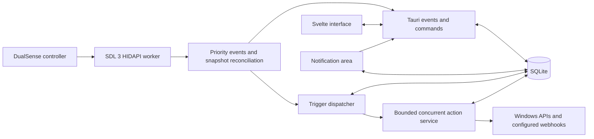

# Architecture

This document describes the production desktop architecture and the boundaries contributors should
preserve as Dual Deck develops toward `1.0.0`.

## Design goals

- Keep controller monitoring and action execution alive when the editor window is hidden.
- Keep profiles and settings local by default.
- Accept only one first-party DualSense during the initial Windows release.
- Represent native actions as validated data rather than shell command strings.
- Keep operating-system code behind a narrow platform interface.
- Bound background queues so a noisy device cannot grow memory without limit.
- Keep the interface responsive by moving device, storage, network, and native work into Rust.

## Runtime map

The Svelte webview is an editor and status surface. It is not the controller runtime. Closing or
hiding the editor leaves the Rust process, controller worker, trigger dispatcher, and action worker
running.

## Components

| Area         | Location                                           | Responsibility                                                                            |
| ------------ | -------------------------------------------------- | ----------------------------------------------------------------------------------------- |
| Interface    | `src`                                              | Controller editor, action library, profiles, settings, status, and accessible interaction |
| Desktop API  | `src/lib/services` and `src-tauri/src/commands.rs` | Typed requests, snapshots, and state-change events across the webview boundary            |
| Domain model | `src-tauri/src/domain.rs`                          | Profiles, bindings, triggers, actions, settings, and execution outcomes                   |
| Persistence  | `src-tauri/src/storage.rs`                         | SQLite schema, migrations, validation, and transactional profile operations               |
| Controller   | `src-tauri/src/controller`                         | SDL lifecycle, DualSense filtering, normalization, snapshots, and bounded event delivery  |
| Dispatch     | `src-tauri/src/dispatch.rs`                        | Active-profile lookup, trigger state, scheduling, and action result events                |
| Actions      | `src-tauri/src/actions.rs`                         | Bounded execution, internal multi-action policy, webhooks, and profile switching          |
| Platform     | `src-tauri/src/platform`                           | Windows process, path, keyboard, media, volume, and sound operations                      |
| Lifecycle    | `src-tauri/src/lifecycle.rs`                       | Single-instance window behavior, close-to-tray, tray menu, and pause state                |

## Controller input path

The SDL worker runs on a dedicated operating-system thread. It accepts Sony vendor ID `054C` and
the first-release DualSense product ID `0CE6`. The first eligible controller becomes active and
additional eligible controllers are counted but ignored.

SDL events are normalized into stable Rust types before they leave the controller module. A shared
snapshot exposes connection data, buttons, axes, pause state, ignored-device count, dropped-event
count, and the most recent update time.

High-frequency axis updates are rate-limited and may be coalesced when consumers cannot keep up.
Digital button edges and lifecycle events use a lossless priority path. When an axis update is
dropped, the worker retries an authoritative snapshot reconciliation on every tick until it is
delivered, so a final release or disconnect cannot leave a repeating action active.

The trigger dispatcher executes button bindings and has internal combination support. The current
editor authors one single-button binding per physical control and exposes Press, Release, Long
press, Double press, and Hold triggers. Trigger state is tracked independently for each binding and
reset on disconnect, pause, reconciliation, or active-profile change. Stick-direction,
trigger-zone, and touchpad-zone domain variants are rejected until dispatch support is implemented.
The physical touchpad click is available as a normal button.

Dual Deck observes the physical controller without claiming exclusive access. It does not suppress
the same input in a foreground game or install a virtual-device driver.

## Action execution path

The dispatcher revalidates enabled bindings against the active profile immediately before execution.
Admission is capped at 64 tasks and execution at 16 concurrent actions, so slow webhooks and delays
do not block unrelated controls or create unbounded waiters. Long-press and hold-repeat tasks check
their trigger generation again after capacity becomes available. The internal multi-action executor
keeps steps ordered, while independent mappings may run concurrently.

The action enum supports:

- Launching a Windows executable with an argument vector and optional working directory
- Opening an existing file or folder
- Opening an HTTP or HTTPS URL
- Sending a supported hotkey or Unicode text
- Sending media and system-volume keys
- Playing a local WAV file
- Sending a bounded HTTP or HTTPS webhook
- Closing a process by validated executable name
- Switching the active profile
- Waiting for a bounded delay
- Running bounded multi-actions with optional stop-on-error behavior; profile switching is rejected
  inside a multi-action so partial failures cannot silently change global profile state

The editor exposes launching, path and URL opening, keyboard and media input, WAV playback,
webhooks, application closing, and profile switching. Standalone delays and multi-actions are
internal backend functionality and are not current release capabilities.

Action results return through Tauri events so the interface can show success or a structured error.
The backend remains authoritative even when an interface field already performs client-side
validation.

## State and persistence

The SQLite database in the Tauri application-data directory is the desktop runtime's source of
truth. Foreign keys are enabled, writes use WAL journaling, and access is serialized through a
single connection lock. Schema changes must be additive migrations keyed by SQLite `user_version`.

Profiles own their bindings. Deleting a profile cascades its bindings, but deleting the only profile
is rejected, as is deleting a profile referenced by another mapping. Settings always reference an
existing active profile. Authoritative snapshots read profiles, bindings, and settings in one
transaction so the editor never merges different database revisions.

The browser-only development preview may use local browser storage. That adapter is not used as the
desktop source of truth and must not gain native behavior.

## Lifecycle and events

Only one Dual Deck process should run. Launching a second instance focuses the existing window.
Closing the main window hides it when close-to-tray is enabled. The tray exposes the active profile,
profile switching, mapping pause or resume, window restore, and explicit quit.

The backend emits three event families:

- Controller events for device and input status
- State-change events that tell the interface to reload an authoritative snapshot
- Action completion or failure events for user feedback

State-change events carry a reason, not a second copy of application state. Reloading one snapshot
avoids merging partial state from multiple producers.

## Trust boundaries

The webview, dropped paths, webhook fields, URLs, and controller events are untrusted inputs.

- Tauri capabilities limit which native plugins the main window can call.
- The content security policy limits script, style, image, and connection sources.
- Native actions are deserialized into a closed enum and validated again in Rust.
- Application launch does not invoke a command shell.
- Webhooks accept only HTTP and HTTPS, limit redirects, headers, body size, and request duration.
- Any future profile-import path must bound file reads before deserialization, validate the entire
  action tree, assign fresh identifiers, and leave mappings disabled until explicit review.
- No updater metadata is consumed in the current product. Future updater artifacts will require
  Tauri signatures; public Windows installers require an independent code-signing identity.

Profiles can contain secrets in typed text or webhook headers. The database, manually copied
database files, and any future exports or backups are not secret stores and should be treated as
sensitive user files.

## Release boundaries

Automatic foreground-application profile switching is not implemented yet. The database stores the
application rule and feature preference so the watcher can be added without changing profile data.

Profile import/export and backup have no production implementation. Multi-action execution is
internal, with no editor or desktop command surface. Native OBS control is also outside the current
release boundary.

The updater plugin is registered, but there is no user-facing update command or flow. Its endpoint
list and public key are empty, the stored update preference is inactive, and updater artifact
generation is disabled. Automatic updates require a separate implementation and release review
after the `sushi-dev55/Dual-Deck` release endpoint, updater key pair, and Windows code-signing
process are configured.

Native OBS control and a public plugin API are outside the current implementation. OBS workflows
can use supported hotkeys or configured webhooks where appropriate.

## Portability

The controller, domain, storage, and interface layers should remain portable. New platform support
belongs behind `DesktopPlatform` implementations and platform-specific packaging configuration.
Windows behavior must not leak into profile serialization unless the action itself is explicitly
platform-specific.

The current Windows build and CI use `x86_64-pc-windows-gnu`. The vendored SDL dependency includes a
matching GNU import library, and its DLL must be on the runtime search path for native tests.
